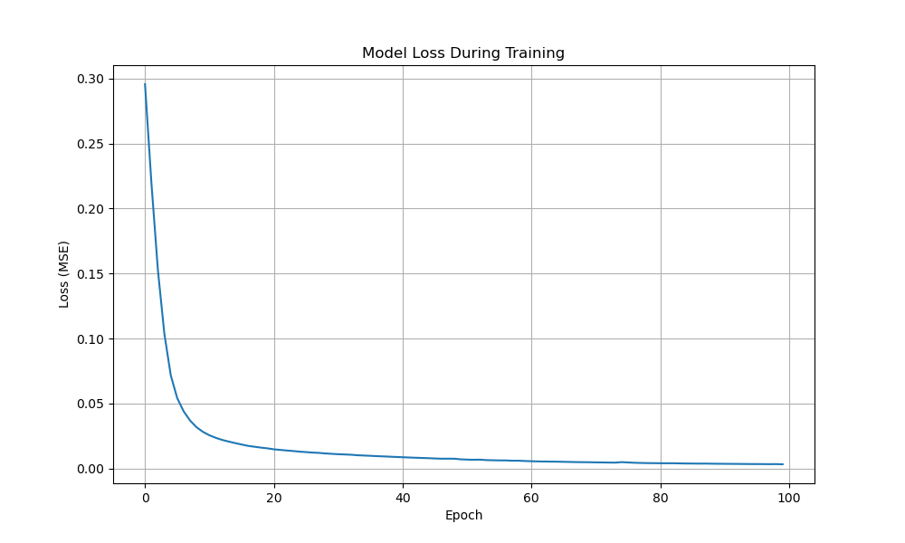
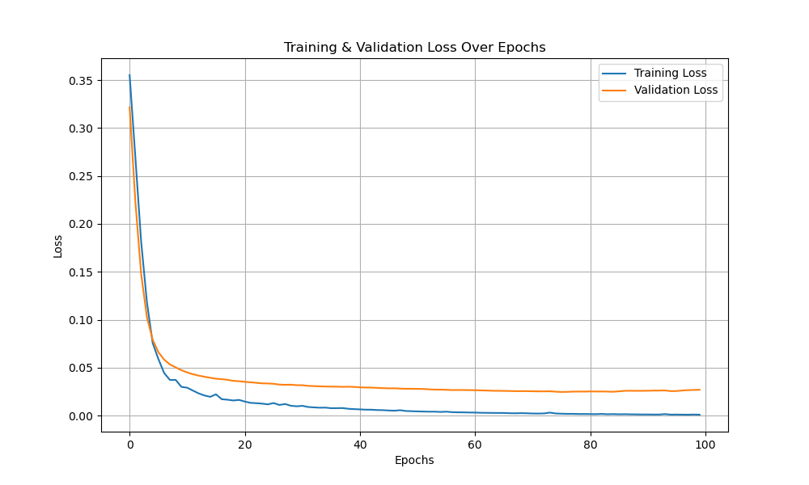
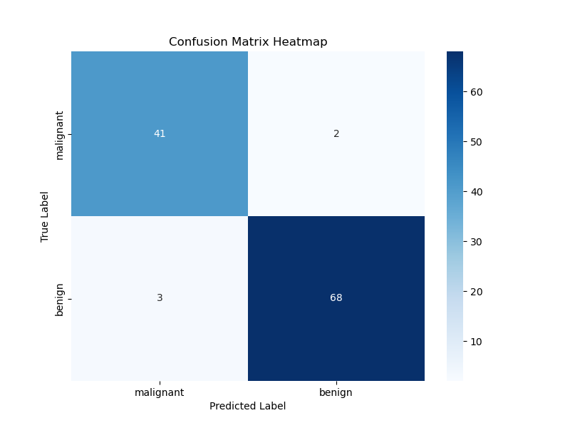

<h1 align="center">🧠 Neural Network Library</h1>
<h3 align="center">From Scratch Implementation Using Python</h3>

<i>Version 1.0 — First Release (Ongoing Improvements)</i>

  <b>Educational Neural Network Project</b> 
  Pure Python • Matrix-Based • Visual Evaluation

<h2>📌 About The Project</h2>

This project is a <b>Neural Network Library implemented completely from scratch using Python</b>.
All components were manually built to gain a deep understanding of how neural networks operate
internally, without relying on high-level deep learning frameworks such as
TensorFlow or PyTorch.

The implementation focuses on <b>matrix operations, activation functions, batch-based training,
training loops, and visual evaluation of model performance</b>.

<h2>✨ Key Features</h2>
<ul>
  <li>Custom Neural Network Architecture</li>
  <li>Neuron, Layer, and Network abstraction</li>
  <li>Activation Functions</li>
  <li>Forward & Backward Propagation</li>
  <li>Batch-based Training Loop</li>
  <li>Mean Squared Error (MSE) Loss</li>
  <li>Gradient Descent Optimization</li>
  <li>Matrix-based Computation using NumPy</li>
  <li>Loss Curve Visualization</li>
  <li>Confusion Matrix with Heatmap</li>
</ul>

<h2>🧩 Implemented Components</h2>

<h3>🔹 Core Architecture</h3>
<ul>
  <li><b>Neuron</b>: Handles individual neuron computation</li>
  <li><b>Layer</b>: Manages neuron groups and matrix operations</li>
  <li><b>Network</b>: Controls forward pass, backward pass, and training process</li>
</ul>

<h3>🔹 Activation Functions</h3>
<ul>
  <li>Activation functions implemented manually</li>
  <li>Introduces non-linearity to improve learning capability</li>
</ul>

<h3>🔹 Loss Functions</h3>
<ul>
  <li>Mean Squared Error (MSE)</li>
  <li>Loss gradient computation</li>
</ul>

<h3>🔹 Optimization</h3>
<ul>
  <li>Gradient Descent optimizer</li>
  <li>Manual weight and bias updates</li>
</ul>

<h3>🔹 Batch Processing</h3>
<ul>
  <li>Batch generation using <code>utils/batch_generator.py</code></li>
  <li>Improves training stability and control</li>
</ul>

<h2>🔁 Training Process</h2>
<ul>
  <li>Custom training loop implemented inside the network</li>
  <li>Includes forward pass, loss calculation, backward pass, and parameter updates</li>
  <li>Training performed over multiple epochs with batch support</li>
</ul>

<h2>📊 Visualization & Evaluation</h2>

<h3>🔹 Training Loss Curve</h3>

Loss values are tracked during training and plotted to visualize
the convergence behavior of the model.

  

<h3>🔹 Training & Validation Loss</h3>

  

<h3>🔹 Confusion Matrix Heatmap</h3>

Model performance is evaluated using a confusion matrix,
visualized with a heatmap using the <b>Seaborn</b> library.

  

<h2>🗂️ Project Structure</h2>
<pre>
.
├── confusion_matrix_heatmap.png
├── loss_curve_batch.png
├── train_val_loss_curve.png
├── nn_library
│   ├── activations
│   │   └── functions.py
│   ├── core
│   │   ├── neuron.py
│   │   ├── layer.py
│   │   └── network.py
│   ├── losses
│   │   └── functions.py
│   ├── optimizers
│   │   └── optimizers.py
│   ├── utils
│   │   └── batch_generator.py
│   └── start.py
├── start.py
</pre>

<h2>⚙️ Requirements</h2>
<ul>
  <li>Python 3.8+</li>
  <li>NumPy</li>
  <li>Matplotlib</li>
  <li>Seaborn</li>
</ul>

<h2>🎓 Learning Outcomes</h2>
<ul>
  <li>Deep understanding of neural network internals</li>
  <li>Strong foundation in matrix-based computation</li>
  <li>Hands-on experience with training loops and batching</li>
  <li>Clear model evaluation using visual tools</li>
</ul>

<h2>👩‍💻 Author</h2>

<b>Amsalma Yaser</b>

<h2>📄 License</h2>

This project is intended for educational and academic use only.

